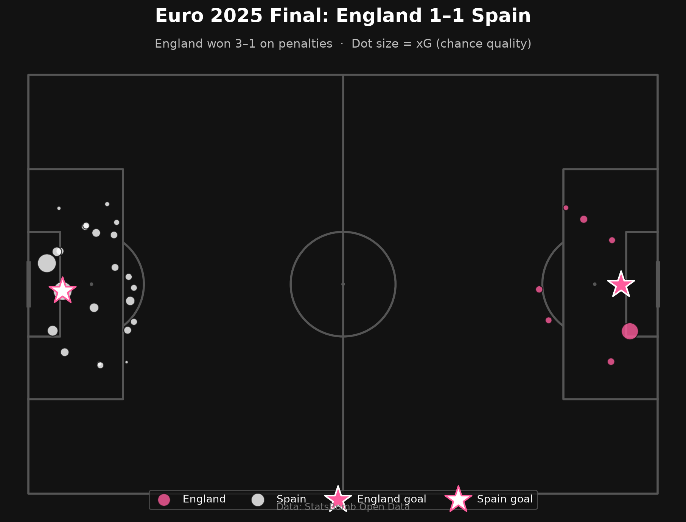
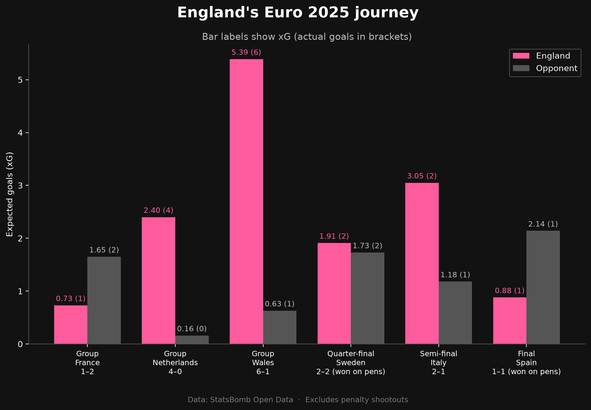
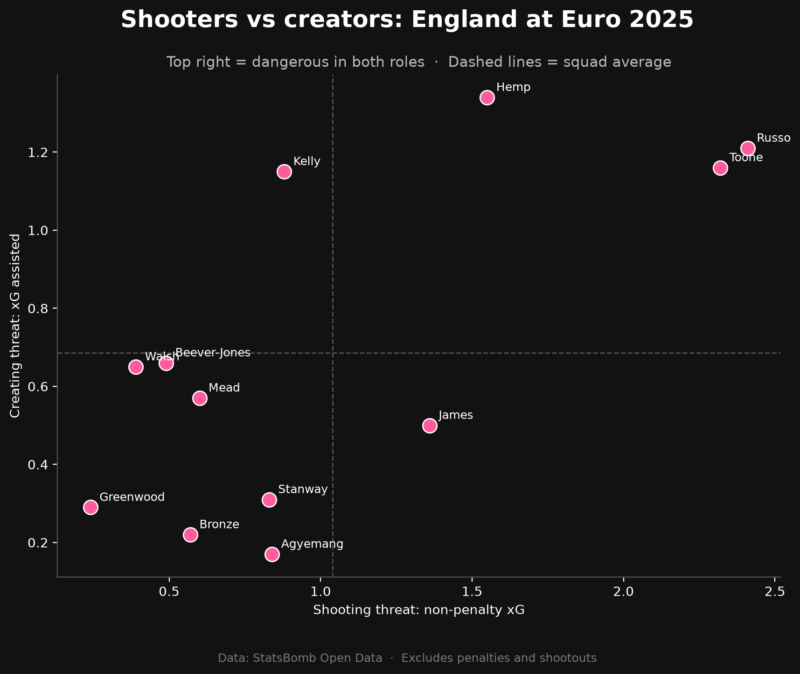
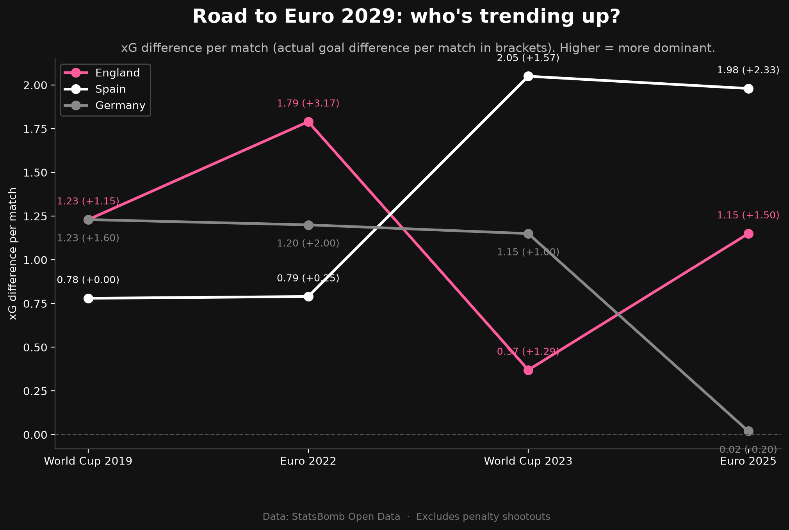
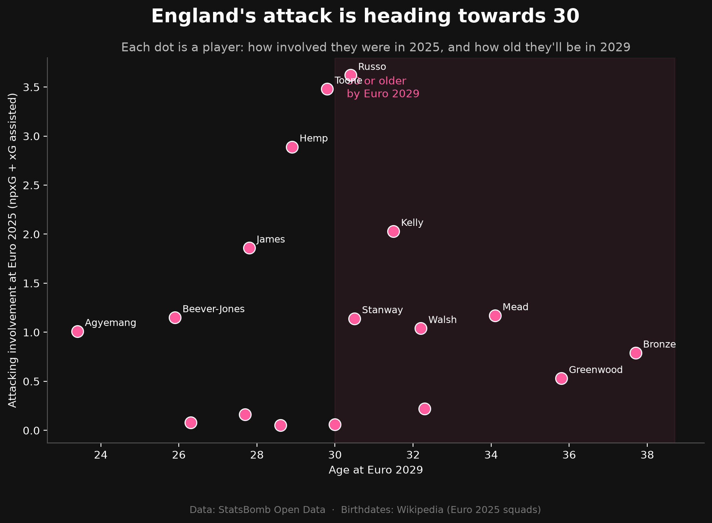

# Women's Football Dashboard ⚽

An interactive dashboard exploring women's football using professional match event data from StatsBomb.

**🔗 [Open the live dashboard](https://lionesses-euro2025.streamlit.app/)**

> ✅ **Status: Live.** Explore the [interactive dashboard](https://lionesses-euro2025.streamlit.app/), or follow the build in the [devlog](DEVLOG.md).



**Latest finding:** In the Euro 2025 final, Spain took nearly three times
as many shots as England (23 vs 8) and generated 2.14 xG to England's 0.88.
But shot for shot, England's chances were just as good, with a slightly
higher average xG per shot. Spain's advantage came from volume, not quality.



**England's journey:** England were out-created in their opening defeat
to France, dominated the Netherlands and Wales, were level on chances
with Sweden, and were clearly stronger than Italy. In the final, Spain
created more than twice England's xG, but England held on and won on penalties.



**Who drove England's attack?** Alessia Russo led England in both
shooting threat and assists, with Ella Toone and Lauren Hemp completing
an attacking core dangerous in both roles. Removing penalties changed
the picture: Chloe Kelly's saved penalty against Italy had made her
look wasteful, when her real strength was creating chances.



**Looking ahead to Euro 2029:** Spain have become the most dominant team
in the data, while Germany, the hosts, dropped sharply at Euro 2025.
England win tournaments through clinical finishing rather than dominance,
and have allowed more chances at every tournament since 2019.



England's attack is ageing: 9 of 17 attacking contributors will be 30
or older by 2029, accounting for 49.8% of their attacking involvement
at Euro 2025. A third straight title may depend on younger players
stepping up.

## Interactive dashboard

The analysis is packaged as a Streamlit dashboard with three sections:

- **Tournament overview:** England's xG and goals across all six matches.
- **Match explorer:** pick any of England's matches to see its key stats
  and shot map.
- **Player view:** who drove England's attack, with a sortable stats table.

To run it locally (after the setup steps below):

    streamlit run app.py

---

## About the project

Men's football is one of the most heavily analysed sports in the world, but the women's game receives a fraction of that attention, despite rapidly growing audiences, investment and professionalism. This project aims to help close that gap by turning detailed match data into clear, interactive visuals that anyone can explore.

The dashboard will cover competitions including the FA Women's Super League, the UEFA Women's Euros and the FIFA Women's World Cup, using event data where every pass, shot, tackle and carry is recorded with its location on the pitch.

### Guiding questions

1. How did England's attacking threat change match by match?
2. Did England deserve their results?
3. Who drove England's attack?
4. How did England defend?
5. Looking ahead: what does the data suggest about England's chances
   of a third consecutive title at Euro 2029 in Germany?

### Why I'm building this

I moved into data from a background in media production. This project brings together the two: the analytical side of working with real, messy data, and the storytelling and visual design skills from my creative work. The goal is a dashboard that isn't just accurate, but genuinely engaging to use.

---

## Data

This project uses **StatsBomb Open Data**, a free collection of professional football event data. Each match contains roughly 3,000 to 4,000 individual events, tagged by analysts watching match footage.

Women's competitions available include:

- FA Women's Super League (2018/19 to 2023/24)
- UEFA Women's Euro (2022, 2025)
- FIFA Women's World Cup (2019, 2023)
- Frauen Bundesliga, Liga F, Serie A Women and the NWSL

Data provided by [StatsBomb](https://github.com/statsbomb/open-data).

---

## Tools and technologies

| Tool                 | What it's used for                                             |
| -------------------- | -------------------------------------------------------------- |
| **Python**           | The programming language for the whole project                 |
| **pandas**           | Loading, cleaning and analysing tables of data                 |
| **statsbombpy**      | Downloading StatsBomb data directly into Python                |
| **mplsoccer**        | Drawing football pitches for shot maps, pass maps and heatmaps |
| **matplotlib**       | Creating charts and visualisations                             |
| **Jupyter Notebook** | Exploring the data step by step                                |
| **Streamlit**        | Building the interactive web dashboard                         |

---

## Project roadmap

- [x] Set up the project environment and GitHub repository
- [x] Load StatsBomb data and filter to women's competitions
- [x] Explore a full match and understand the event data
- [x] Choose the project's focus (England's Euro 2025 journey)
- [x] Build tournament overview chart (xG and goals, match by match)
- [x] Build first visualisation (shot map of the Euro 2025 final)
- [x] Build further visualisations (player analysis)
- [x] Assemble the interactive Streamlit dashboard
- [x] Looking ahead to Euro 2029 (trends and squad ages)
- [x] Publish the dashboard online
- [ ] Stretch goal: build a simple expected goals (xG) model
- [ ] Record a short demo video walkthrough

---

## Project structure

```
womens-football-dashboard/
├── app.py                              # The Streamlit dashboard
├── 01_exploration.ipynb                # Exploring the StatsBomb data
├── 02_shot_map.ipynb                   # Shot map and xG analysis of the final
├── 03_england_journey.ipynb            # England's six matches and player analysis
├── 04_looking_ahead.ipynb              # Trends and squad ages for Euro 2029
├── data/
│   ├── shots_2019_2025.csv             # Shots from four tournaments
│   ├── england_ages.csv                # Player birthdates
│   └── england_players_euro2025.csv    # England player stats
├── shot_map_euro2025_final.png         # Shot map of the final
├── england_journey_xg.png              # Tournament overview chart
├── england_players_npxg.png            # Top 10 by non-penalty xG
├── england_shooters_vs_creators.png    # Shooters vs creators chart
├── road_to_2029_trend.png              # Rivals trend chart
├── england_age_2029.png                # Squad age chart
├── DEVLOG.md                           # Session-by-session development log
├── requirements.txt                    # Python libraries needed
├── .gitignore                          # Files excluded from the repository
└── README.md                           # You are here
```

---

## How to run it yourself

1. Clone the repository:

   ```
   git clone https://github.com/georgiajayy/womens-football-dashboard.git
   cd womens-football-dashboard
   ```

2. Create and activate a virtual environment:

   ```
   python -m venv .venv

   # Windows
   .venv\Scripts\activate

   # Mac / Linux
   source .venv/bin/activate
   ```

3. Install the required libraries:

   ```
   pip install -r requirements.txt
   ```

4. Open the notebook:

   ```
   jupyter notebook
   ```

   pip install jupyter

   ```

   ```

---

## Devlog

I'm documenting each session of this project, including what I built, what I learned and what confused me along the way. Read it in [DEVLOG.md](DEVLOG.md).

---

## Acknowledgements

- [StatsBomb](https://statsbomb.com/) for making their event data freely available
- [mplsoccer](https://mplsoccer.readthedocs.io/) for the football pitch plotting library

---

**Georgia** · [GitHub](https://github.com/georgiajayy)
